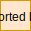
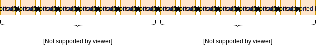
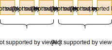

# Bin - fast struct serializer/deserializer

[](https://cloud.drone.io/dyrkin/bin)

## Overview

## Table of contents
* [Features](#features)
    * [Bitmask](#bitmask)
    * [Endianness](#endianness)
    * [Bound](#bound)

## Features

### Bitmask

**Encode**

```go
type Bitmask struct {
    Param1   uint8 `bits:"0b00000111" bitmask:"start"`
    Param2   uint8 `bits:"0b00001000"`
    Param3   uint8 `bits:"0b11110000" bitmask:"end"`
}

bitmask := &Bitmask{5, 1, 9}
payload := Encode(bitmask)
spew.Dump(payload)
```

Output:



**Decode**

```go
type Bitmask struct {
    Param1   uint8 `bits:"0b00000111" bitmask:"start"`
    Param2   uint8 `bits:"0b00001000"`
    Param3   uint8 `bits:"0b11110000" bitmask:"end"`
}

bitmask := &Bitmask{}
payload := []uint8{0x9D}
Decode(payload, bitmask)
spew.Dump(bitmask)
```

Output:

```shell
(*bin.Bitmask)({
 Param1: (uint8) 5,
 Param2: (uint8) 1,
 Param3: (uint8) 9
})
```

### Endianness

**Encode**

```go
type Endianness struct {
    Param1   uint64 `endianness:"be"` //Big Endian
    Param2   uint64 `endianness:"le"` //Little Endian
}

endianness := &Endianness{12345, 12345}
payload := Encode(endianness)
spew.Dump(payload)
```

Output:



**Decode**

```go
type Endianness struct {
    Param1   uint64 `endianness:"be"` //Big Endian
    Param2   uint64 `endianness:"le"` //Little Endian
}

endianness := &Endianness{}
payload := []uint8{00, 00, 00, 00, 00, 00, 0x30, 0x39,  0x39, 0x30, 00, 00, 00, 00, 00, 00}
Decode(payload, endianness)
spew.Dump(endianness)
```

Output:

```shell
(*bin.Endianness)({
 Param1: (uint64) 12345,
 Param2: (uint64) 12345
})
```

### Bound

This tag is used to add support for `uint24`, `uint40`, `uint48`, `uint56`, `int24`, `int40`, `int48`, `int56` data types.

**Encode**

```go
type Bound struct {
    Param1   uint32 `bound:"3"` //Serialize uint32 as uint24
    Param2   int32  `bound:"3"` //Serialize int32 as int24
}

bound := &Bound{12345, -12345}
payload := Encode(bound)
spew.Dump(payload)
```

Output:



**Decode**

```go
type Endianness struct {
    Param1   uint64 `endianness:"be"` //Big Endian
    Param2   uint64 `endianness:"le"` //Little Endian
}

endianness := &Endianness{}
payload := []uint8{00, 00, 00, 00, 00, 00, 0x30, 0x39,  0x39, 0x30, 00, 00, 00, 00, 00, 00}
Decode(payload, endianness)
spew.Dump(endianness)
```

Output:

```shell
(*bin.Endianness)({
 Param1: (uint64) 12345,
 Param2: (uint64) 12345
})
```
