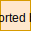
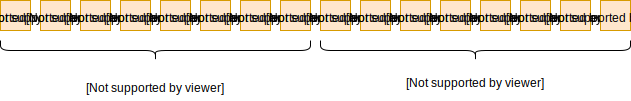

# Bin - fast binary data serializer/deserializer

[](https://cloud.drone.io/dyrkin/bin)

## Overview

## Examples

### Bitmask

**Encode**

```go
type Bitmask struct {
    Param1   uint8 `bits:"0b00000111" bitmask:"start"`
    Param2   uint8 `bits:"0b00001000"`
    Param3   uint8 `bits:"0b11110000" bitmask:"end"`
}

bitmask := &Bitmask{5, 1, 9}
payload := Encode(bitmask)
spew.Dump(payload)
```

Output:



**Decode**

```go
type Bitmask struct {
    Param1   uint8 `bits:"0b00000111" bitmask:"start"`
    Param2   uint8 `bits:"0b00001000"`
    Param3   uint8 `bits:"0b11110000" bitmask:"end"`
}

bitmask := &Bitmask{}
payload := []uint8{0x9D}
Decode(payload, bitmask)
spew.Dump(bitmask)
```

Output:

```shell
*Bitmask{5, 1, 9}
```

### Endianness

**Encode**

```go
type Endianness struct {
    Param1   uint64 `endianness:"be"` //Big Endian
    Param2   uint64 `endianness:"le"` //Little Endian
}

endianness := &Endianness{12345, 12345}
payload := Encode(endianness)
spew.Dump(payload)
```

Output:



**Decode**

```go
type Bitmask struct {
    Param1   uint8 `bits:"0b00000111" bitmask:"start"`
    Param2   uint8 `bits:"0b00001000"`
    Param3   uint8 `bits:"0b11110000" bitmask:"end"`
}

bitmask := &Bitmask{}
payload := []uint8{0x9D}
Decode(payload, bitmask)
spew.Dump(bitmask)
```

Output:

```shell
*Bitmask{5, 1, 9}
```
